# 병원 HIS 전체 업무 흐름도

## 1. 접수 — 원무과

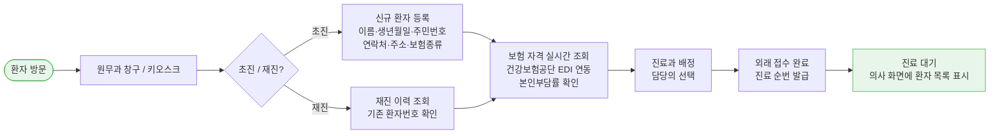

---

## 2. 진료실 — 의사

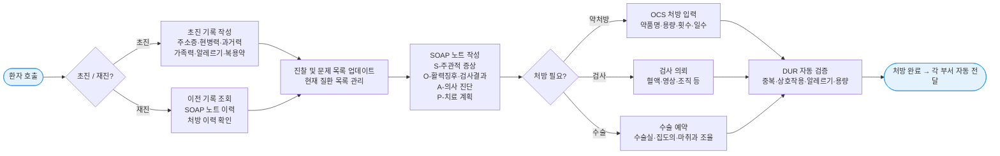

---

## 3. OCS 처방 전달 — 의사 → 각 부서

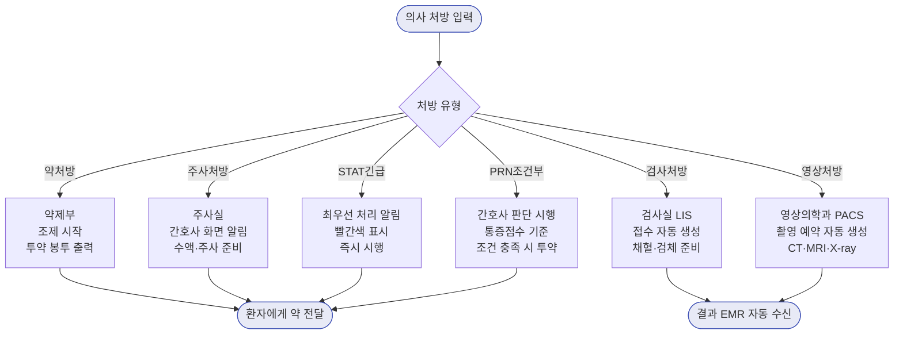

---

## 4. 간호 기록 — 간호사

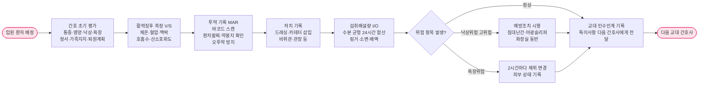

---

## 5. 진료지원 — 검사실·영상의학과

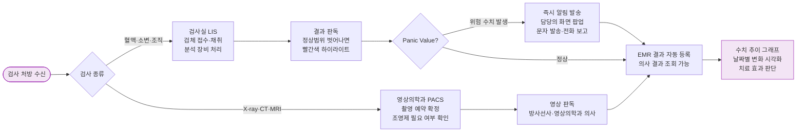

---

## 6. 입퇴원 — 원무과 + 병동 간호사

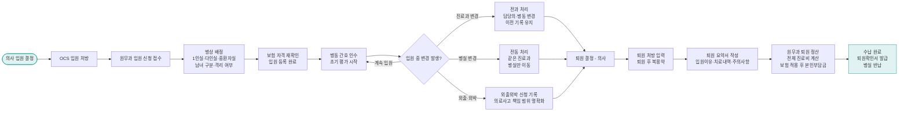

---

## 7. 수술 — 외과·마취과·수술실

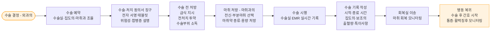

---

## 8. 청구·수납 — 보험팀·원무과

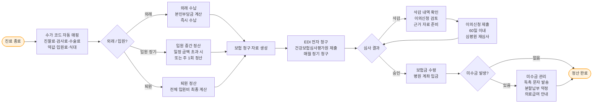

---

## 9. CRM — 고객지원팀

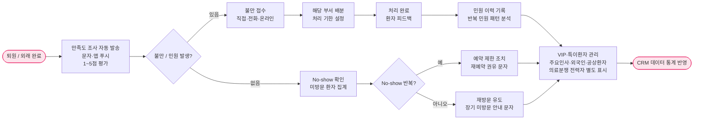

---

## 10. 통계·결산 — 기획팀·재무팀

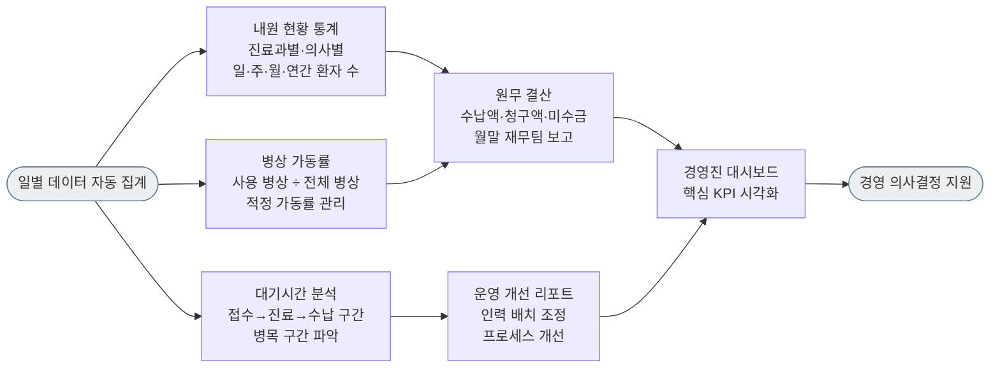

---

## 11. 전체 시스템 연계 구조

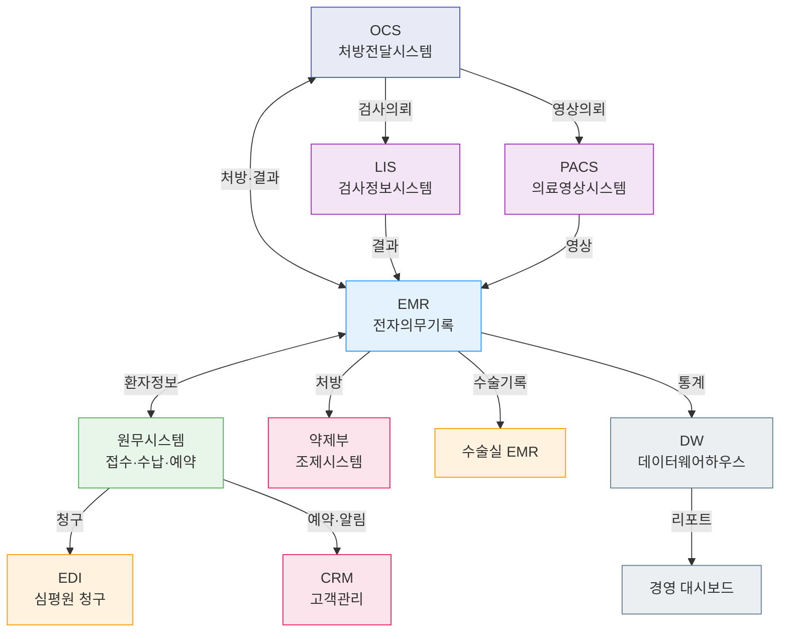
