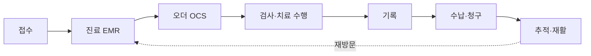

# 00. 개요와 읽는 법

## 문서 목적
이 문서 세트는 정형외과·재활 병원정보시스템을 **시스템 구성요소별로 분류**하여, 각 요소의
개념·목적·주요 기능·데이터·프로세스 흐름·다른 시스템과의 연결을 정의한다.
개발 전 팀원이 "무엇을, 왜 만드는지"를 같은 언어로 이해하기 위한 기술 참고 문서다.

## 분류 기준
부서가 아니라 **시스템 구성요소**로 나눈다. 한 환자 흐름 안에서 여러 시스템이 계속 만나기 때문이다.

| 기준 | 설명 |
|---|---|
| 시스템 구성요소 | HIS, OCS, EMR, PACS, LIS/RIS 등 기능 단위 |
| 특화 모듈 | 재활 스케줄링·기능평가, 환자 포털(PHR) |
| 공통 기반 | 표준(KCD·DICOM·HL7), 보안·권한·로그 |

## 공통 용어

| 용어 | 의미 |
|---|---|
| 오더(Order) | 의사가 내리는 처방·지시 (검사·약·처치·재활 등) |
| SOAP | 진료기록 표준 형식 (Subjective·Objective·Assessment·Plan) |
| ROM / MMT / VAS | 관절가동범위 / 도수근력검사 / 통증 시각척도 |
| KCD | 한국표준질병사인분류 (진단명 코드) |
| DICOM / HL7 | 의료영상 표준 / 의료정보 연동 표준 |
| PHR | 개인건강기록 (환자 주도 관리) |

## 큰 흐름

## 출처
프로젝트 「참고자료」 13개 문서 및 「참고자료_종합검토보고서」 기준. 상세 번호는 각 문서 하단 참조.
