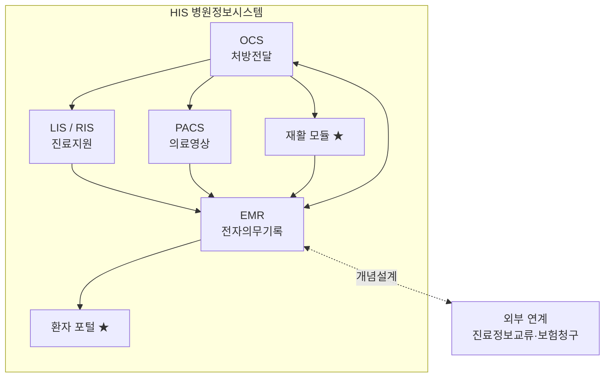

# 01. HIS — 병원정보시스템 (Hospital Information System)

## 개념
병원이 **진료·간호·행정·재정·물류·인사** 등 업무 전반을 통합적으로 전산화한 시스템이다. [4][7]
원래 행정업무 보조용으로 출발했으나, 점차 진료 지원·서비스로 확산되었고 최근에는 임상적 의사결정의
주요 수단으로까지 역할이 확대되고 있다. [4]

## 목적
- 진료 대기시간 단축, 처방 누락 방지, 업무 효율화 [6]
- 흩어진 부서 업무(원무·간호·의사·검사·영상·재활)를 **하나의 환자 데이터**로 연결
- 경영통계 기반 의사결정 지원 [6]

## 구성요소
HIS는 소프트웨어 관점에서 다음으로 구성된다. [7]

| 구성요소 | 역할 | 문서 |
|---|---|---|
| OCS | 처방·오더의 발생과 부서 전달 | [02](02-OCS-처방전달시스템.md) |
| EMR | 진료기록의 작성·보관·관리 | [03](03-EMR-전자의무기록.md) |
| PACS | 의료영상 저장·전송·판독 | [04](04-PACS-의료영상.md) |
| 진료지원(LIS/RIS) | 진단검사·영상의학 업무 | [05](05-진료지원-LIS-RIS.md) |
| 특화·공통 | 재활 모듈, 환자 포털, 표준·보안 | [06](06-재활특화-스케줄링과기능평가.md) 외 |

## 시스템 간 관계도

## 본 프로젝트에서의 위치
정형외과·재활 환자의 **외래→검사→치료→재활→추적** 전 과정을 단일 HIS로 처리하며,
일반 HIS와 달리 재활 스케줄링·기능평가·환자 포털을 특화로 포함한다.

## 출처
[4] K-디지털헬스케어 이해하기–병원정보시스템(KHIDI) · [6] 보건의료정보기술–병원정보시스템 구성 · [7] 보건의료정보학
