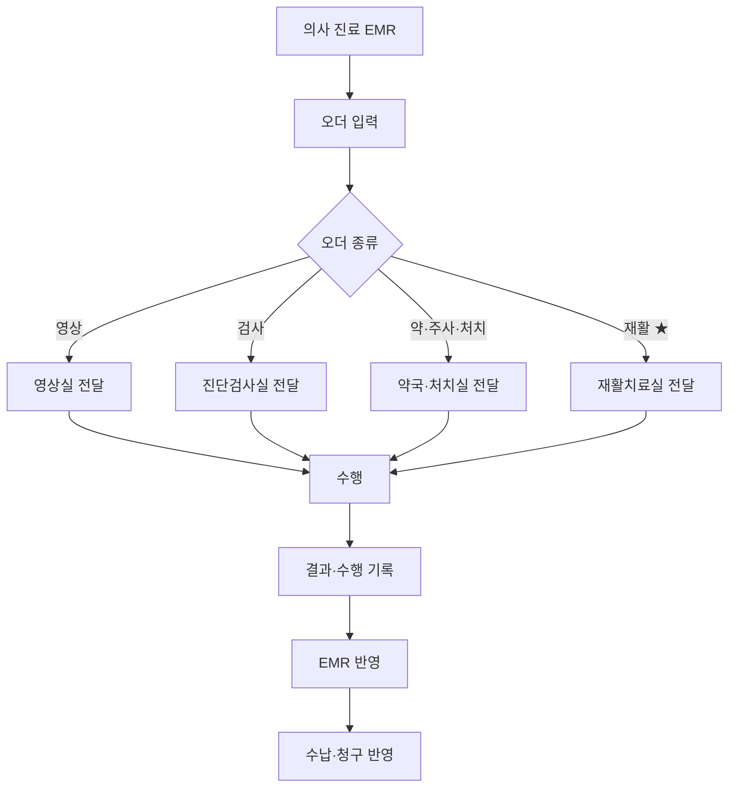

# 02. OCS — 처방전달시스템 (Order Communication System)

## 개념
의사가 입력한 **처방(오더)** 을 검사실·약국·병동·치료실 등 관련 부서로 네트워크를 통해 전달하는 시스템이다. [6]
환자가 접수에서 진료·수납에 이르는 과정의 업무·진료·일반행정(보험청구 등)을 포괄한다. [6]

## 목적
- 처방 정보를 정확·신속하게 수행 부서로 전달 → **진료 대기시간 단축, 처방 누락 방지** [6]
- 병상 회전율 증가, 경영 효율화 [6]

## 주요 기능
| 분류 | 기능 |
|---|---|
| 진료시스템 | 외래·병동 처방 입력/조회, 병동간호 입력/조회 |
| 원무관리 | 환자등록, 진료비 계산/수납, 보험청구 |
| 진료지원 전달 | 임상병리·방사선·약품·급식 등으로 오더 전달 |

## 오더 종류 (정형외과·재활 관점)
| 오더 | 수행 부서 | 연결 |
|---|---|---|
| 영상검사 오더 | 영상실(RIS/PACS) | [04](04-PACS-의료영상.md) |
| 진단검사 오더 | 진단검사실(LIS) | [05](05-진료지원-LIS-RIS.md) |
| 약/주사/처치 오더 | 약국·처치실 | — |
| 재활치료 오더 ★ | 재활치료실 | [06](06-재활특화-스케줄링과기능평가.md) |

## 프로세스 흐름도

## 오더 상태값
| 상태 | 의미 |
|---|---|
| 발행 | 의사가 오더 입력 완료 |
| 전달됨 | 수행 부서 대기열에 등록 |
| 수행중 | 검사·치료 진행 중 |
| 완료 | 결과/수행 기록 완료 |
| 취소 | 오더 취소(사유 기록) |

## 출처
[6] 보건의료정보기술–병원정보시스템 구성 (OCS 기능·기대효과)
