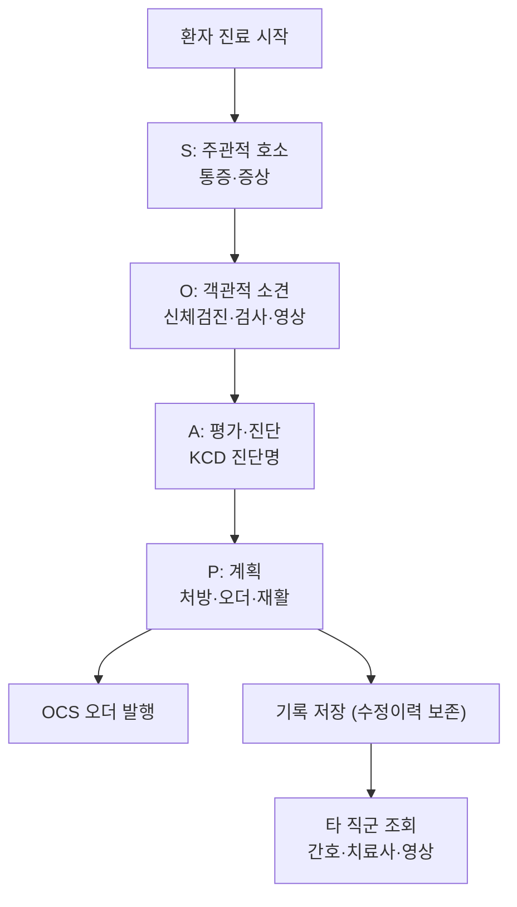

# 03. EMR — 전자의무기록 (Electronic Medical Record)

## 개념
종이차트에 기록되던 **모든 의료기록의 구성과 내용을 전자문서화**한 시스템이다. [6]
처방정보도 하나의 기록으로 보아 OCS 기능까지 포괄하는 확장 개념으로 발전했다. [6]
법적으로는 **의료법 제23조**에 따라 의료인이 작성하는 진료기록부 등을 전자적으로 기록·보관·관리하는 것을 말한다. [1]

## 목적
- 의무기록 작성 효율 향상, 구조화 데이터로 임상정보 추출 [6]
- 진료 연속성·환자안전 지원 (EMR 인증제의 목적) [4]
- 발전 방향: **AMR → CMR → EMR → EHR → PHR** (기관 내부 → 기관 간 교류 → 개인 건강기록) [6]

## 주요 기능
| 분류 | 기능 |
|---|---|
| 진료기록 | SOAP 작성, 진단명(KCD) 입력, 과거력·알레르기 |
| 처방 연계 | OCS 오더 발행·조회 |
| 기록 관리 | 작성·조회·수정, **수정 이력 보존** (인증 기능성) [2] |
| 조회 | 검사·영상 결과, 재활 기능평가 통합 조회 |

## 진료 기록 흐름

## 데이터 핵심 항목
| 항목 | 설명 |
|---|---|
| 환자 식별 | 환자번호, 인적정보(마스킹 대상) |
| 방문/진료건 | 외래·입원 구분, 진료일, 담당의 |
| 진단 | KCD 코드 + 진단명 |
| 처방/오더 | OCS와 연계되는 오더 목록 |
| 기록 이력 | 작성자·시각·수정 이력 |

## 다른 시스템과의 연결
- OCS: 오더 발행·결과 회신 [02](02-OCS-처방전달시스템.md)
- PACS/LIS: 영상·검사 결과 조회 [04](04-PACS-의료영상.md) [05](05-진료지원-LIS-RIS.md)
- 환자 포털: 진료기록·재활 진행 공유 [07](07-환자포털-PHR.md)

## 출처
[1] EMR 인증제도 운영 고시(의료법 제23조) · [2] EMR 인증기준 해설서(기능성) · [4] K-디지털헬스케어 · [6] 보건의료정보기술
