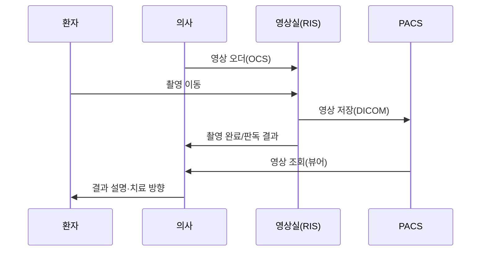
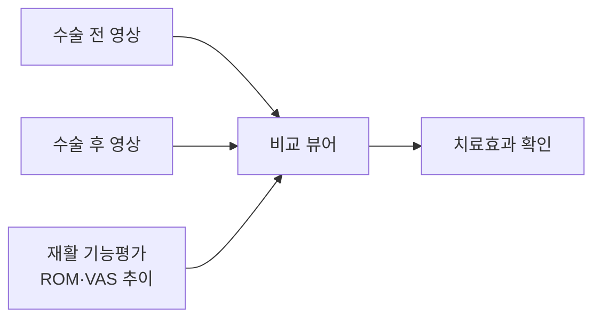

# 04. PACS — 의료영상저장전송시스템 (Picture Archiving and Communication System)

## 개념
의료영상기기로 획득한 디지털 이미지를 **고속 네트워크로 전송·저장·검색·판독**하는 통합 영상관리 시스템이다. [6]
X-ray·CT·MRI·PET·내시경 영상을 디지털로 변환·저장하여 영상의학과 전문의가 모니터로 판독한다. [6]

## 목적
- 필름 비용 절감, 판독 대기시간 단축, 여러 곳에서 동시 판독 [6]
- 정형외과의 핵심 진단 근거(골절·관절) 및 **수술 전후 비교** 제공

## 표준
| 표준 | 용도 |
|---|---|
| DICOM | 의료영상 국제표준 (이미지 형식·해상도·촬영정보) [6] |
| HL7 | HIS와의 데이터 연동 표준 [6] |

> ⚠️ 한계: PACS 업체가 **DICOM 헤더 표준을 지키지 않으면** 영상 교류가 실패한다. [8]

## 프로세스 흐름도 (외래 영상검사)

## 본 프로젝트 특화 — 수술 전후 영상 비교 ★
재활 기능평가 점수(ROM·VAS)와 **수술 전/후 영상**을 한 화면에서 비교 조회하여 치료효과를 확인한다.
환자 중심 의료영상 공유 개념을 일부 차용(개념설계+뷰어 연계). [8]

## 다른 시스템과의 연결
- OCS: 영상 오더 수신 [02](02-OCS-처방전달시스템.md)
- EMR: 판독 결과·영상 링크 기록 [03](03-EMR-전자의무기록.md)
- RIS: 접수·예약·판독 관리 [05](05-진료지원-LIS-RIS.md)

## 출처
[6] 보건의료정보기술(PACS·DICOM·HL7) · [8] 2024 환자 중심 의료영상 공유체계 시범사업
