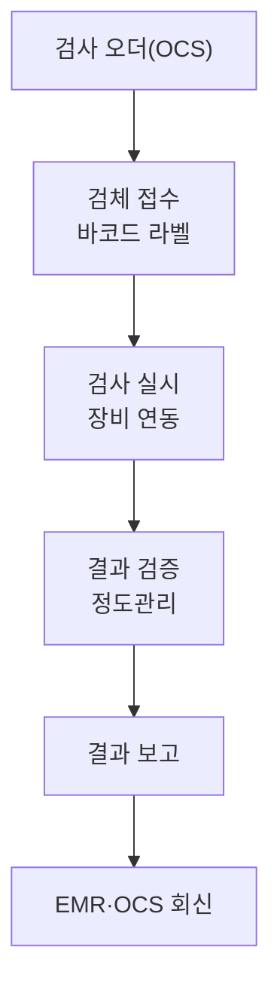

# 05. 진료지원시스템 — LIS / RIS

## 개념
진료를 지원하는 검사·영상의학 업무 시스템이다. [6]

| 시스템 | 정의 |
|---|---|
| **LIS** (진단검사의학) | 검사 의뢰부터 결과 보고까지 검사 업무를 처리, 검사장비와 연동해 결과 자동 입력 [6] |
| **RIS** (영상의학) | 영상검사 처방확인·접수·예약·검사수행·판독결과 관리, PACS와 연계 [6] |

## 목적
- 검사·영상 업무를 신속·정확하게 처리하고 결과를 OCS·EMR로 회신 [6]
- 정형외과 진단(혈액검사·염증수치, X-ray/MRI)의 근거 데이터 제공

## LIS 검사 흐름

## RIS / PACS 연계

## 상태값
| 상태 | 의미 |
|---|---|
| 의뢰 | 오더 접수 |
| 접수/예약 | 검체 접수 또는 검사 예약 |
| 수행중 | 검사·촬영 진행 |
| 결과검증 | 정도관리·판독 |
| 보고완료 | 결과 EMR 회신 |

## 출처
[6] 보건의료정보기술 (LIS·RIS 정의·업무)
