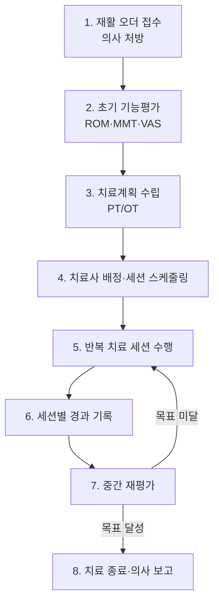
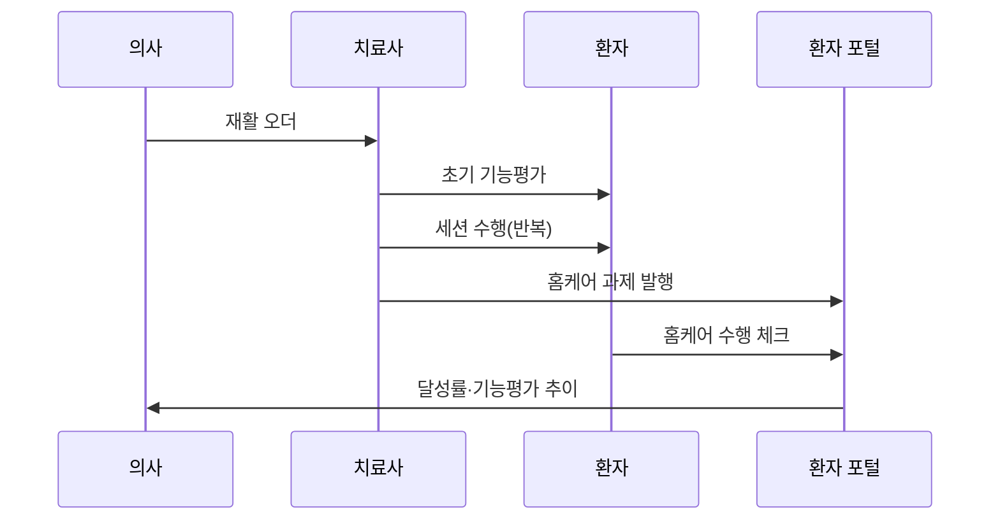

# 06. 재활 특화 모듈 — 스케줄링 & 기능평가 ★

> 본 프로젝트의 **핵심 차별화** 영역. 일반 HIS에는 없거나 약한 부분이다.

## 개념
정형외과 수술·처치 후 이어지는 **재활치료**를 시스템으로 지원하는 모듈.
재활은 1회성이 아니라 **반복 세션**으로 진행되며, 기능 회복 정도를 **표준 척도로 시계열 측정**한다.

## 목적
- 재활 오더 → 치료계획 → 치료사 배정 → 반복 세션 → 재평가의 연속성 관리
- EMR의 텍스트 위주 한계를 보완해 **구조화된 기능평가 데이터** 축적 [12]

## 6.1 재활치료 스케줄링
| 기능 | 설명 |
|---|---|
| 오더 변환 | 의사 재활 오더 → PT/OT 처방 |
| 치료사 배정 | 치료사별 가용시간 기반 세션 예약 |
| 반복 일정 | 주 N회 × M주 반복 스케줄 |
| 리소스 관리 | 치료실·장비 충돌 방지, No-show·잔여 세션 관리 |

## 6.2 운동·기능평가 기록
| 척도 | 의미 |
|---|---|
| ROM | 관절가동범위 |
| MMT | 도수근력검사 |
| VAS | 통증 시각척도 |
| 보행/균형 | 기능 수준 평가 |

→ 초기평가 → 중간 재평가 → 종료평가를 **시계열 그래프**로 비교, 수술 전후 영상과 함께 조회. [8]

## 재활 프로세스 흐름도

## 환자 흐름 속 위치

## 다른 시스템과의 연결
- OCS: 재활 오더 수신 [02](02-OCS-처방전달시스템.md)
- EMR: 기능평가·세션 기록 [03](03-EMR-전자의무기록.md)
- 환자 포털: 홈케어 연계 [07](07-환자포털-PHR.md)

## 출처
[8] 환자 중심 의료영상 공유체계(수술 전후 비교) · [12] 의료정보의 대중화(EMR 구조화 한계)
