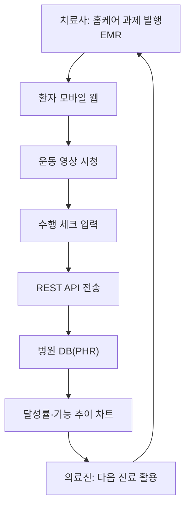

# 07. 환자 포털 / PHR ★

> 의료진 중심 EMR을 넘어 **환자 참여형** 으로 확장하는 차별화 모듈.

## 개념
환자가 모바일 웹으로 본인 진료기록·재활 진행을 조회하고, **집에서 수행한 자가 재활(홈케어)** 결과를
병원으로 전송하는 **피드백 루프**. PHR(개인건강기록)은 EMR의 발전 방향이다 (EMR→EHR→**PHR**). [6][12]

## 목적
- 재활 성패를 좌우하는 **자가 운동**을 시스템으로 관리 [12]
- 전자문서 기반 환자 정보제공 (전자문서법상 종이와 동일 효력) [12]
- 풀스택 관점에서 환자 참여형 아키텍처 시연

## 주요 기능
| 기능 | 설명 |
|---|---|
| 홈케어 과제 발행 | 치료사가 EMR에서 환자 맞춤 운동 과제 발행 |
| 수행 체크 | 환자가 모바일 웹에서 운동 영상 시청·수행 체크 |
| PHR 전송 | 수행 데이터를 REST API로 병원 DB 전송 |
| 달성률 차트 | 의료진이 다음 진료 시 홈케어 달성률·기능 추이 확인 |
| 기록 조회 | 진료기록·다음 예약·기능평가 추이 조회 |

## 피드백 루프 흐름도

## 구현 메모 (2개월 기준)
- 구현 난이도: 과제 CRUD + 체크 + REST 전송 + 차트 → **기간 내 구현 가능**
- 운동 영상은 직접 제작 대신 **외부 링크/샘플** 로 대체해 부담 축소

## 다른 시스템과의 연결
- EMR: 과제 발행·진료기록 [03](03-EMR-전자의무기록.md)
- 재활 모듈: 기능평가·세션 [06](06-재활특화-스케줄링과기능평가.md)
- 보안: 환자 본인 인증·접근권한 [08](08-연계-표준-보안.md)

## 출처
[6] 보건의료정보기술(EMR→PHR 발전단계) · [12] 의료정보의 대중화(PHR·전자문서·자가관리)
