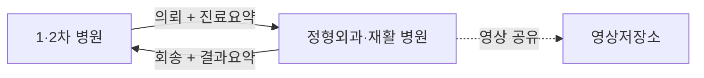
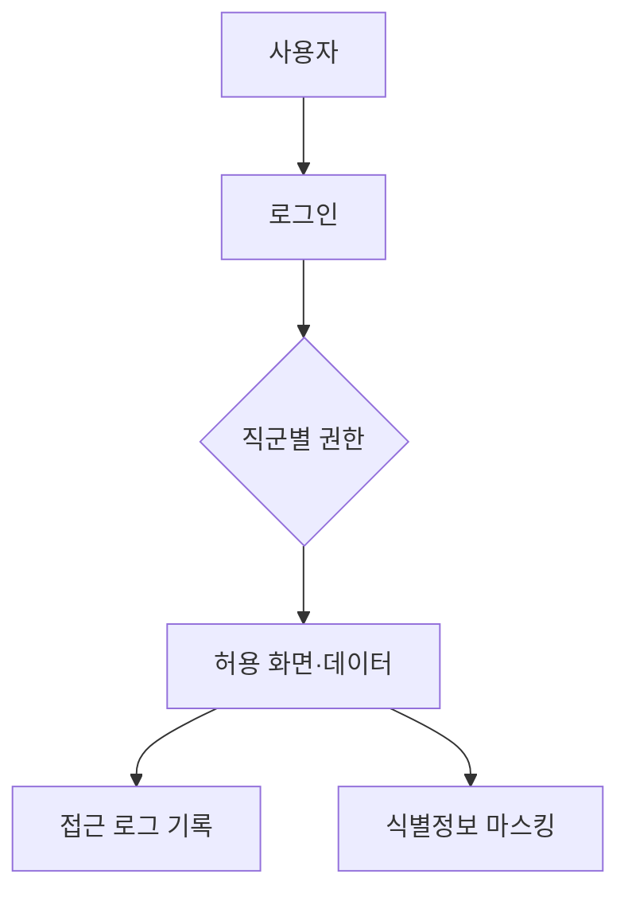

# 08. 연계 · 표준 · 보안 (공통 기반)

모든 시스템에 공통으로 적용되는 기반 영역이다.

## 8.1 표준
표준화 미흡은 국내 EMR의 **근본 한계**로 지적된다. [12] 가능한 범위에서 표준을 차용해 "표준을 의식한 설계"를 한다.

| 영역 | 표준/적용 | 수준 |
|---|---|---|
| 진단명 | KCD(한국표준질병사인분류) | 일부 구현 |
| 용어·코드 | 공통코드 테이블 표준화 [9] | 구현 |
| 서식 | SOAP·재활 평가 서식 원소 표준화 [9] | 구현 |
| 영상 | DICOM 헤더 [6][8] | 개념 |
| 연동 | HL7 [6] | 개념 |
| 교류 | 진료의뢰·회송 요약(CCD) 구조 [4][8] | 개념설계 |

## 8.2 진료정보 교류 (개념)
의료기관 간 의뢰·회송 시 진료요약을 표준 형식으로 주고받아 중복검사를 줄이고 진료 연속성을 높인다. [4]
> 한계: 지정 기관 간 **1:1 교류**만 지원되는 점, DICOM 헤더 미준수로 인한 교류 실패. [8]

## 8.3 보안 · 개인정보 보호
전산화는 복제 편의성에 따른 **개인정보 보안 취약점**을 동반한다. [12]
개인정보 영향평가 기준의 보호조치를 설계에 반영한다. [5]

| 항목 | 적용 |
|---|---|
| 인증/인가 | 로그인, 직군별 접근권한(의사·간호·치료사·원무·환자) [9] |
| 접근 로그 | 주요 조회·수정 행위 감사 로그 [5] |
| 개인정보 | 최소수집, 비밀번호 암호화, 환자식별정보 마스킹 [5] |
| 기록 이력 | 진료기록 수정 이력 보존 [1][2] |

## 8.4 법·제도 근거 (합법 범위)
| 근거 | 내용 | 출처 |
|---|---|---|
| 의료법 제22·23·23조의2 | 진료기록·전자의무기록·표준화 | [1][2] |
| EMR 인증제 3부문 | 기능성·상호운용성·보안성 | [2] |
| 개인정보 보호법 | 노출 차단·침해 대응·권리보장·파기·보호조치 | [5] |

> 본 프로젝트는 인증 취득이 목적이 아니며, 위 기준을 **설계 가이드**로만 차용한다.

## 출처
[1] EMR 인증 고시 · [2] EMR 인증기준 해설서 · [4] K-디지털헬스케어 · [5] 진료정보교류 개인정보 영향평가 · [6] 보건의료정보기술 · [8] 의료영상 공유체계 · [9] 의료정보관리 A to Z · [12] 의료정보의 대중화
