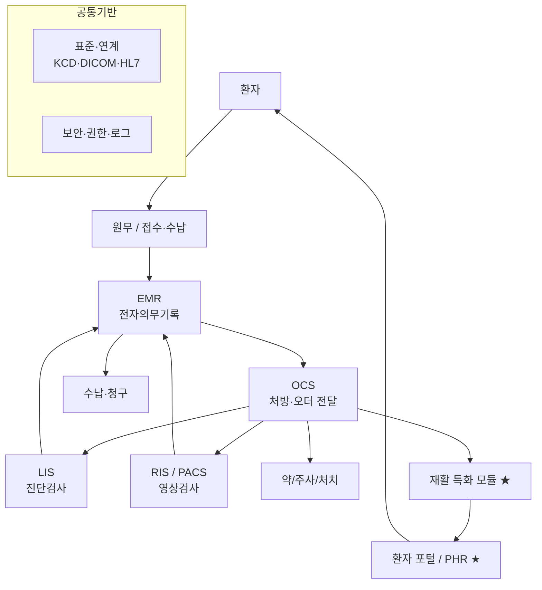

# 정형외과·재활 병원정보시스템(HIS) 시스템 정의

정형외과·재활의학과 특화 HIS 프로젝트의 **시스템 구성요소별 개념·목적·기능·프로세스 흐름**을 정리한 문서 세트입니다.
기획보고서가 "프로젝트 관점"이라면, 이 문서들은 **시스템 구성요소(HIS·OCS·EMR·PACS …) 관점**으로 분류한 기술 참고 문서입니다.

> 모든 흐름도는 GitHub에서 자동 렌더링되는 **Mermaid**로 작성했습니다. (Preview 탭에서 그림으로 보입니다)

## 전체 구성 한눈에 보기

## 읽는 순서

| 순서 | 문서 | 내용 |
|---|---|---|
| 00 | [개요와 읽는 법](00-개요와-읽는법.md) | 문서 분류 기준과 공통 용어 |
| 01 | [HIS 병원정보시스템](01-HIS-병원정보시스템.md) | 전체 통합 시스템 개념 |
| 02 | [OCS 처방전달시스템](02-OCS-처방전달시스템.md) | 오더의 발생과 전달 |
| 03 | [EMR 전자의무기록](03-EMR-전자의무기록.md) | 진료기록의 작성·보관 |
| 04 | [PACS 의료영상](04-PACS-의료영상.md) | 영상 저장·전송·판독 |
| 05 | [진료지원 LIS·RIS](05-진료지원-LIS-RIS.md) | 검사·영상의학 업무 |
| 06 | [재활 특화 모듈 ★](06-재활특화-스케줄링과기능평가.md) | 스케줄링·기능평가 |
| 07 | [환자 포털 / PHR ★](07-환자포털-PHR.md) | 홈케어·환자 참여 |
| 08 | [연계·표준·보안](08-연계-표준-보안.md) | 표준·법·개인정보 |

## 범례
- ★ : 본 프로젝트의 특화/차별화 영역
- 출처 표기 `[n]` : 프로젝트 「참고자료」 문서 번호 (각 문서 하단 출처 참조)
