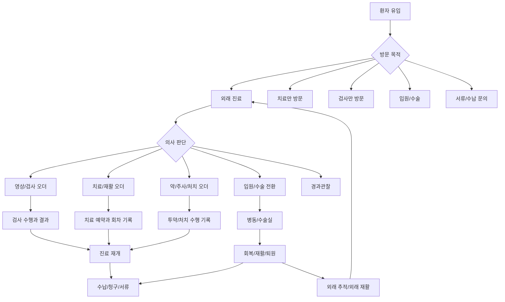
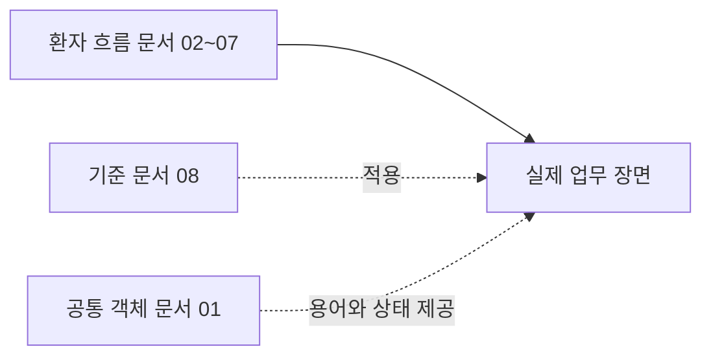

# 전체 흐름과 문서 읽는 법

## 문서 목적

이 폴더는 정형외과 재활 병원 업무를 기능 목록이 아니라 **환자가 병원 안에서 실제로 지나가는 흐름**으로 이해하기 위한 문서 세트다.

기존 문서들은 외래, 영상, 치료, 입원, 수술, 환자안전, 청구, 권한 같은 중요한 주제를 잘 담고 있었지만, 분류 기준이 섞여 있었다. 이 재구성 문서는 부서별 메뉴나 보완 문서의 순서가 아니라, 환자 여정과 업무가 발생하는 장면을 따라 읽도록 다시 배열한다.

## 가장 큰 흐름

정형외과 재활 병원의 업무는 `외래 접수 -> 진료 -> 오더 -> 수행 -> 기록 -> 비용/청구 -> 추적`으로 이어진다. 환자가 수술이나 입원으로 넘어가면 이 흐름은 병동과 수술실까지 확장되고, 퇴원 후 다시 외래 재활로 돌아온다.

## 이 문서 세트의 분류 기준

문서는 부서별로 나누지 않는다. 원무, 간호, 의사, 영상실, 치료실, 병동, 수술실, 심사는 한 환자 흐름 안에서 계속 만난다. 따라서 문서는 다음 기준으로 나눈다.

| 기준 | 설명 |
|---|---|
| 큰 장면 | 외래, 검사/치료 오더, 반복 재활, 입원/수술, 병동 회복, 퇴원 같은 환자가 실제로 지나가는 구간 |
| 공통 객체 | 환자, 방문, 접수, 진료건, 오더, 수행, 기록, 예약, 수납/청구 |
| 통제 기준 | 환자안전, 법정 기준, 접근권한, 감사 로그처럼 모든 장면에 반복 적용되는 기준 |
| 병원 확인 사항 | 병상, 수술실, PACS/EMR, 청구 프로그램, 약제 운영처럼 대상 병원마다 달라질 수 있는 부분 |

## 읽는 순서

| 순서 | 문서 | 읽는 이유 |
|---|---|---|
| 00 | `00-전체-흐름과-문서-읽는-법.md` | 전체 지도와 읽는 방법을 잡는다. |
| 01 | `01-병원-업무를-나누는-기준.md` | 환자, 방문, 오더, 수행, 기록 같은 공통 언어를 고정한다. |
| 02 | `02-외래-방문과-진료-흐름.md` | 환자가 외래로 들어와 진료 방향이 결정되는 과정을 본다. |
| 03 | `03-검사와-치료로-이어지는-외래-오더.md` | 의사 오더가 영상, 치료, 약/주사/처치 업무로 갈라지는 방식을 본다. |
| 04 | `04-반복-치료와-재활-관리.md` | 치료가 회차별로 반복되고 기록이 다시 의사 판단으로 돌아오는 구조를 본다. |
| 05 | `05-입원과-수술로-전환되는-흐름.md` | 외래 진료가 입원/수술 프로세스로 바뀌는 지점을 본다. |
| 06 | `06-수술과-병동-회복-흐름.md` | 수술실, 회복실, 병동 하루 운영과 회진을 이어서 본다. |
| 07 | `07-퇴원과-외래-추적-재활.md` | 입원 치료가 퇴원 후 외래 추적과 외래 재활로 연결되는 지점을 본다. |
| 08 | `08-비용-서류-안전-권한-기준.md` | 수납, 청구, 서류, 환자안전, 법정 기준, 권한/감사를 공통 기준으로 정리한다. |

## 읽을 때 주의할 점

`08-비용-서류-안전-권한-기준.md`는 마지막 단계라서 마지막에만 적용되는 문서가 아니다. 비용, 기록, 환자안전, 법정 동의, 접근권한은 외래, 치료, 수술, 병동, 퇴원 전부에 걸친다.

## 기존 문서와의 관계

이 문서는 기존 `00-overall-process-map.md`, `02-process-analysis-framework-gap-review.md`, `09-realistic-planning-baseline.md`, `16-post-supplement-realistic-risk-review.md`의 역할을 합쳐서 새 문서 세트의 입구로 다시 쓴 것이다.

다음 문서: [01-병원-업무를-나누는-기준.md](01-병원-업무를-나누는-기준.md)
