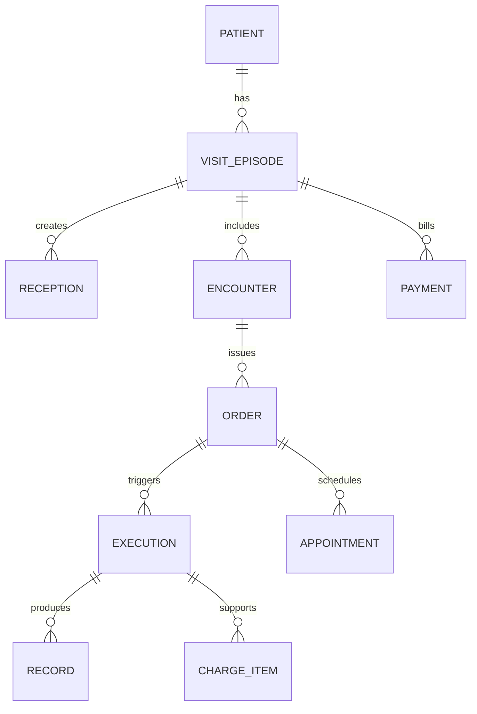
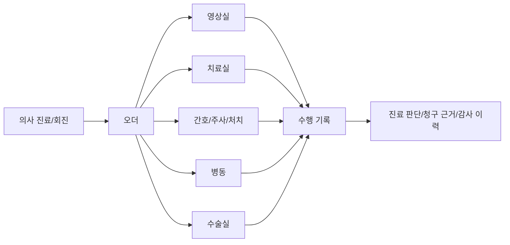

# 병원 업무를 나누는 기준

## 문서 목적

이 문서는 병원 프로세스를 어떤 단위로 나눠야 하는지 정리한다. 정형외과 재활 병원 업무를 부서명이나 화면 메뉴만으로 나누면 실제 흐름이 보이지 않는다. 환자가 어떤 상태로 들어왔고, 의사가 어떤 판단을 했고, 그 판단이 어떤 부서 업무를 발생시키는지까지 함께 봐야 한다.

## 핵심 원칙

병원 업무는 하나의 `환자 상태`로 표현하기 어렵다. 환자, 방문, 접수, 진료건, 오더, 수행, 기록, 예약, 비용은 서로 연결되어 있지만 생명주기가 다르다.

## 기본 업무 단위

| 단위 | 의미 | 예시 |
|---|---|---|
| 환자 | 병원에 등록된 사람 자체 | 김OO 환자 |
| 방문 에피소드 | 특정 목적을 가지고 병원에 온 사건 | 오늘 외래, 오늘 치료, 입원, 서류 발급 방문 |
| 접수 | 오늘 병원 업무 흐름에 들어온 상태 | 외래 접수, 치료 접수, 입원 접수 |
| 진료건 | 의사가 환자를 보고 판단하는 단위 | 초진, 재진, 회진, 수술 후 추적 진료 |
| 오더 | 의사 판단이 다른 부서 업무로 넘어가는 지시 | 영상 오더, 치료 오더, 투약 오더, 입원 오더 |
| 수행 | 오더를 받은 부서가 실제 업무를 수행한 사건 | 촬영, 치료, 투약, 처치, 수술 전 검사 |
| 기록 | 다음 사람이 이어받기 위해 남기는 결과 | 진료기록, 영상결과, 치료기록, 간호기록 |
| 예약 | 미래의 진료, 치료, 검사, 수술 일정 | 외래 예약, 치료 예약, 수술 예약 |
| 비용 항목 | 수행 또는 서류 발급에 따라 발생하는 비용 단위 | 진료비, 검사비, 치료비, 주사비, 제증명 수수료 |

## 분석할 때 봐야 하는 순서

문서나 화면을 설계할 때는 먼저 누가 무엇을 하는지보다, 어떤 환자가 어떤 이유로 들어왔는지부터 봐야 한다.

| 순서 | 분석 단위 | 질문 |
|---|---|---|
| 1 | 환자 유형 | 이 환자는 왜 왔고 어떤 위험이나 맥락을 가지고 있는가? |
| 2 | 방문 목적 | 오늘 방문은 외래, 치료, 검사, 입원, 수술, 서류 중 무엇인가? |
| 3 | 역할 | 이 장면에서 원무, 간호, 의사, 영상실, 치료실, 병동, 수술실 중 누가 움직이는가? |
| 4 | 상태 | 환자나 업무는 현재 대기, 수행중, 결과대기, 완료, 보류 중 어디에 있는가? |
| 5 | 오더 | 의사 판단이 어떤 부서의 실제 업무를 발생시키는가? |
| 6 | 자원 | 병상, 치료사, 장비, 수술실, 진료실 같은 제한 자원이 흐름을 바꾸는가? |
| 7 | 예외 | 지연, 취소, 노쇼, 외부자료, 담당의 변경, 입원 전환이 발생하는가? |
| 8 | 기록 | 다음 사람이 이어받기 위해 무엇이 반드시 남아야 하는가? |

## 오더는 연결 객체다

의사가 모든 일을 직접 수행하지 않는다. 의사는 판단하고 오더를 발행하며, 오더가 다른 부서 업무를 발생시킨다.

## 상태를 분리해야 하는 이유

외래 방문이 끝나도 치료 오더는 살아 있을 수 있다. 수술 예약이 있어도 동의서나 검사 결과가 끝나지 않으면 수술은 확정되지 않는다. 촬영이 완료되어도 공식 판독은 아직 대기 중일 수 있다.

| 혼동하기 쉬운 것 | 분리해야 하는 이유 |
|---|---|
| 방문 완료와 오더 완료 | 외래는 끝났지만 치료 오더는 여러 주 동안 진행될 수 있다. |
| 촬영 완료와 판독 완료 | 정형외과 X-ray는 즉시 볼 수 있어도 공식 결과와는 다를 수 있다. |
| 수술 예약과 수술 확정 | 병상, 검사, 동의, 수술실, 집도의 일정이 모두 맞아야 한다. |
| 치료 예약과 치료 수행 | 예약, 노쇼, 취소, 수행 완료는 서로 다르다. |
| 수납과 청구 | 환자 결제와 보험 청구/심사는 생명주기가 다르다. |

## 문서 전체에서 반복되는 기본 상태

| 상태 묶음 | 예시 |
|---|---|
| 방문 상태 | 예약됨, 접수완료, 대기중, 진료중, 수납대기, 완료 |
| 오더 상태 | 초안, 발행됨, 확인됨, 스케줄됨, 진행중, 보류, 중단, 완료 |
| 수행 상태 | 대기, 준비중, 수행중, 수행완료, 기록완료, 미수행 |
| 기록 상태 | 작성중, 확정, 정정, 무효, 발급, 전송 |
| 비용 상태 | 비용항목생성, 검토대기, 수납완료, 청구완료, 심사중, 정산완료 |

## 기존 문서와의 관계

이 문서는 기존 `00-overall-process-map.md`의 업무 객체, `02-process-analysis-framework-gap-review.md`의 분석 틀, `09-realistic-planning-baseline.md`의 기본값을 합쳐서 공통 기준으로 정리한 것이다.

이전 문서: [00-전체-흐름과-문서-읽는-법.md](00-전체-흐름과-문서-읽는-법.md)  
다음 문서: [02-외래-방문과-진료-흐름.md](02-외래-방문과-진료-흐름.md)
