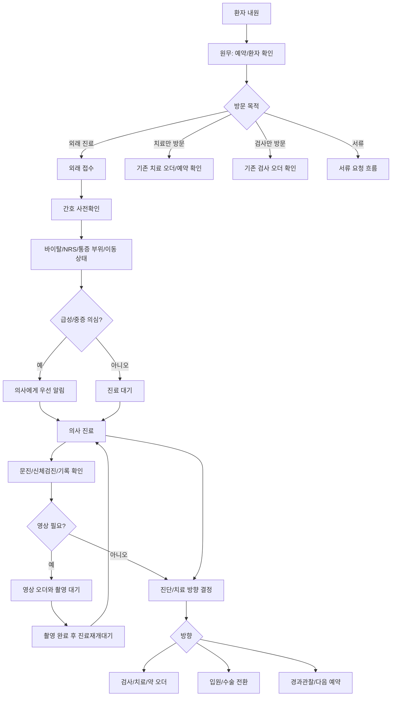
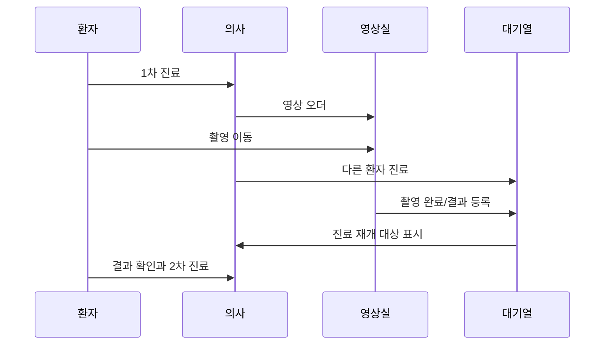

# 외래 방문과 진료 흐름

## 문서 목적

이 문서는 환자가 외래로 들어와 접수, 간호 사전확인, 의사 진료, 영상 대기, 치료/입원/수술 분기까지 이어지는 기본 흐름을 정리한다.

외래는 `접수 -> 진료 -> 수납`으로 끝나지 않는다. 정형외과 재활 병원에서는 영상검사 때문에 진료가 중간에 끊기고, 치료 오더가 치료실 일정으로 분리되며, 급성 환자는 입원이나 수술로 전환될 수 있다.

## 외래 환자 유형

| 유형 | 특징 | 흐름 차이 |
|---|---|---|
| 신규 급성 | 골절, 낙상, 급성 통증처럼 당일 내원 | 영상검사 가능성이 높고 당일 입원/수술 전환 가능성이 있다. |
| 신규 만성 | 관절염, 오래된 통증, 반복 통증 | 이전 병원 영상이나 소견서 확인 비중이 크다. |
| 재진 보존치료 | 약, 주사, 물리치료 중 경과 확인 | 기존 오더 유지/변경/중단 판단이 핵심이다. |
| 수술 후 재진 | 수술 후 경과와 재활 상태 확인 | 수술기록, 병동기록, 치료기록을 이어봐야 한다. |
| 의뢰 환자 | 타 병원 소견서와 영상자료 지참 | 외부자료 접수, 참고, 재촬영 여부를 결정해야 한다. |

## 외래 기본 흐름

## 역할별 흐름

| 순서 | 역할 | 실제 업무 | 다음 연결 |
|---|---|---|---|
| 1 | 원무 | 환자 식별, 예약 확인, 신규 등록, 보험 확인, 접수 생성 | 간호 사전확인 또는 부서 대기열 |
| 2 | 간호 | 바이탈, 통증 부위, NRS, 이동 상태, 알레르기, 급성도 확인 | 의사 진료와 우선순위 판단 |
| 3 | 의사 | 문진, 신체검진, 과거 기록/외부자료 확인 | 영상/검사 오더 또는 치료 방향 결정 |
| 4 | 영상실 | 영상 오더 확인, 촬영, 결과 등록 | 진료재개대기 |
| 5 | 의사 | 영상 확인 후 진단과 치료 방향 확정 | 치료, 약/주사/처치, 입원/수술, 경과관찰 |
| 6 | 원무/치료실/간호 | 수납, 치료 예약, 주사/처치, 다음 예약 | 귀가 또는 다음 프로세스 |

## 외래에서 자주 끊기는 지점

정형외과 외래의 대표적인 끊김은 영상검사다.

이 구간을 `진료중` 하나로 표현하면 부족하다. 최소한 `영상대기`, `촬영중`, `촬영완료`, `진료재개대기`를 구분해야 한다.

## 외래 상태값

| 상태 | 의미 |
|---|---|
| 예약됨 | 외래 예약은 있으나 아직 내원 전 |
| 접수완료 | 오늘 내원해서 진료 대기열에 들어감 |
| 사전확인중 | 간호 사전확인 수행 중 |
| 사전확인완료 | 의사가 볼 수 있는 사전정보가 준비됨 |
| 진료중 | 의사가 진료 중 |
| 영상대기 | 영상 오더 후 촬영 전 |
| 촬영중 | 환자가 영상 촬영 중 |
| 진료재개대기 | 영상 촬영 후 의사 진료로 돌아갈 대기 상태 |
| 오더확정 | 진료 방향과 오더가 확정됨 |
| 치료대기 | 당일 치료 또는 치료 예약을 기다림 |
| 수납대기 | 수납 항목이 확정되어 결제 대기 |
| 입원전환중 | 외래에서 입원 프로세스로 넘어감 |
| 완료 | 오늘 외래 방문 종료 |

## 기획에서 확인해야 할 질문

| 질문 | 이유 |
|---|---|
| 영상 후 돌아온 환자를 대기열 어디에 넣는가 | 외래 운영 속도와 환자 경험이 달라진다. |
| 간호 사전확인은 모든 환자에게 필수인가 | 병원 인력과 환자 유형에 따라 달라진다. |
| 급성 환자의 우선 진료 기준은 무엇인가 | 단순 접수순으로 처리하면 안전 문제가 생길 수 있다. |
| 외부 영상은 파일 업로드까지 할 것인가 | 개인정보, 보관 정책, PACS 연동 범위가 달라진다. |
| 당일 치료를 기본으로 보는가 | 치료실 스케줄과 수납 시점이 달라진다. |

## 기존 문서와의 관계

이 문서는 기존 `01-outpatient-patient-types-and-flow.md`와 `04-outpatient-swimlane-flow.md`를 합쳐 외래 장면 하나로 다시 정리한 것이다.

이전 문서: [01-병원-업무를-나누는-기준.md](01-병원-업무를-나누는-기준.md)  
다음 문서: [03-검사와-치료로-이어지는-외래-오더.md](03-검사와-치료로-이어지는-외래-오더.md)
