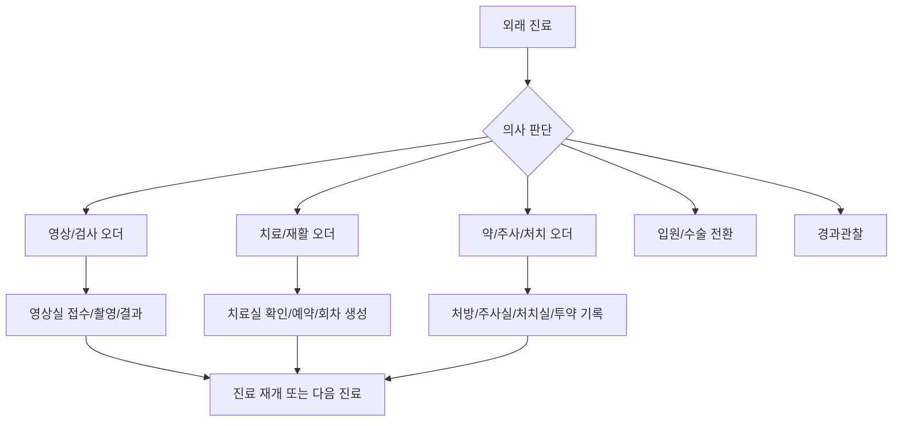
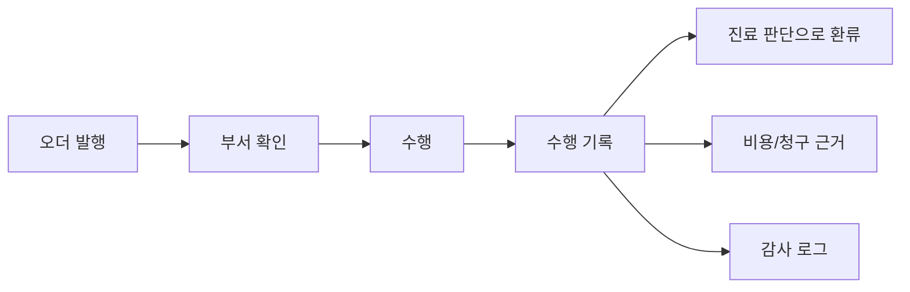

# 검사와 치료로 이어지는 외래 오더

## 문서 목적

이 문서는 외래 진료에서 의사가 판단한 뒤 발행하는 오더가 영상검사, 치료실 예약, 약/주사/처치로 어떻게 이어지는지 정리한다.

외래 오더는 버튼 하나로 끝나는 기능이 아니다. 오더가 발행되면 다른 부서가 환자를 확인하고, 자원을 배정하고, 실제 수행을 기록하며, 그 결과가 다시 의사 판단과 비용 근거로 돌아온다.

## 외래 오더의 큰 분기

입원/수술 전환은 [05-입원과-수술로-전환되는-흐름.md](05-입원과-수술로-전환되는-흐름.md)에서 다룬다.

## 영상검사 오더

영상검사는 외래 진료를 중간에 끊고 다시 재개시키는 핵심 업무다.

| 단계 | 담당 | 실제 업무 |
|---|---|---|
| 영상 필요 판단 | 의사 | 검사 종류, 부위, 좌우, 의심 소견, 우선순위 결정 |
| 오더 확인 | 영상실 | 신규 오더 확인, 환자 식별, 촬영 가능 여부 확인 |
| 촬영 수행 | 영상실 | 부위/좌우 확인 후 촬영 |
| 결과 등록 | 영상실/판독 담당 | 이미지 확인 가능, 판독중, 판독완료 상태 등록 |
| 진료 재개 | 의사 | 영상 확인 후 진단과 치료 방향 확정 |

### 영상 상태

| 상태 | 의미 |
|---|---|
| 오더됨 | 의사가 영상검사를 지시함 |
| 영상실접수 | 영상실이 오더를 확인함 |
| 대기중 | 환자가 촬영을 기다림 |
| 촬영중 | 실제 촬영 중 |
| 촬영완료 | 촬영이 끝남 |
| 이미지확인가능 | 의사가 이미지를 열람할 수 있음 |
| 판독중 | 공식 판독 또는 결과 정리 중 |
| 판독완료 | 공식 결과가 등록됨 |
| 진료재개대기 | 환자가 의사 진료로 돌아갈 대기 상태 |

## 치료/재활 오더

치료 오더는 치료실 일정과 회차 기록으로 이어진다. 외래 예약과 치료 예약은 연결되어 있지만 같은 예약이 아니다.

| 구분 | 외래 예약 | 치료 예약 |
|---|---|---|
| 기준 | 의사와 진료실 일정 | 치료사, 장비, 베드, 치료 공간 |
| 시작 조건 | 예약 또는 접수 | 의사의 치료 오더 |
| 빈도 | 2~4주에 한 번인 경우가 많음 | 주 2~5회 반복 가능 |
| 결과 | 진료기록, 오더, 처방 | 회차별 치료기록 |

치료 오더에는 치료 부위, 종류, 횟수/기간, 치료 강도, 금기사항, 수술명/수술일 같은 연계 정보가 들어가야 한다.

## 약/주사/처치 오더

약, 주사, 처치는 물리치료와 비슷하게 의사 오더에서 시작하지만, 안전과 비용 리스크가 더 직접적이다.

| 구분 | 예시 | 관리 포인트 |
|---|---|---|
| 원외 약 처방 | 진통제, 소염제, 근이완제 | 처방전, DUR/상호작용, 복약 안내 |
| 원내 투약 | 입원 중 정규약, PRN 진통제 | 투약 스케줄, 실제 투약 시간, 미투약 사유 |
| 외래 주사 | 관절 주사, 통증 주사 | 부위/좌우, 약품, 수행자, 이상반응 관찰 |
| 처치 | 드레싱, 실밥 제거, 상처 확인 | 처치 기록, 감염 의심 소견, 재료 사용 |
| 고위험 약품 | 마약류/향정신성의약품 | 별도 보관, 사용, 폐기, 보고 흐름 |

## 수행 전 안전 확인

영상, 치료, 주사, 처치는 모두 수행 전에 환자 확인과 오더 확인이 필요하다.

| 수행 | 확인해야 하는 것 |
|---|---|
| 영상 | 환자 식별, 검사 부위, 좌우, 이동 주의 |
| 치료 | 환자 식별, 치료 부위, 금기 동작, 통증 수준, 수술 후 제한 |
| 주사/처치 | 환자 식별, 약물/용량/경로, 알레르기, 부위/좌우 |
| 투약 | 약명, 용량, 투여 경로, 예정 시간, 실제 시간 |

## 비용과 기록으로 돌아오는 지점

오더만으로 비용을 확정하면 안 된다. 비용 근거는 실제 수행 기록에서 나온다.

## 기존 문서와의 관계

이 문서는 기존 `06-imaging-order-result-flow.md`, `11-medication-injection-treatment-order-flow.md`, 그리고 `03-treatment-order-and-postoperative-rehab-flow.md`의 외래 오더 부분을 묶었다. 반복 치료와 재활 관리는 다음 문서에서 더 자세히 다룬다.

이전 문서: [02-외래-방문과-진료-흐름.md](02-외래-방문과-진료-흐름.md)  
다음 문서: [04-반복-치료와-재활-관리.md](04-반복-치료와-재활-관리.md)
