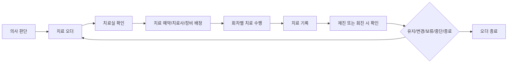
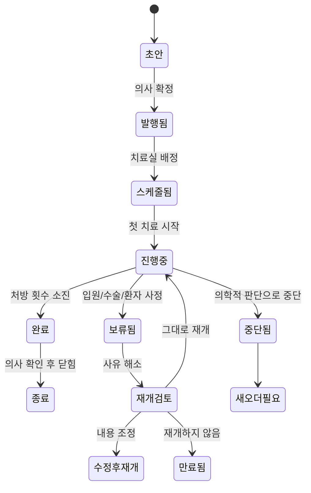

# 반복 치료와 재활 관리

## 문서 목적

이 문서는 물리치료, 도수치료, 운동치료, 수술 후 재활처럼 반복되는 치료가 어떻게 예약되고 수행되며, 치료 기록이 다시 의사 판단으로 돌아오는지 정리한다.

정형외과 재활 병원에서 치료 오더는 살아 있는 업무 객체다. 발행 후 여러 회차로 나뉘고, 보류/중단/재개될 수 있으며, 수술 후에는 목적이 다른 재활 오더로 바뀔 수 있다.

## 치료 오더 기본 흐름

## 치료 오더에 담겨야 하는 정보

| 항목 | 설명 |
|---|---|
| 치료 부위 | 어깨, 무릎, 허리, 발목 등 |
| 치료 종류 | 전기치료, 온열치료, 도수치료, 운동치료, 보행훈련 등 |
| 횟수/기간 | 10회, 2주, 주 3회 등 |
| 치료 강도 | 수동 운동, 능동 운동, 부분 체중부하, 전 체중부하 등 |
| 주의사항 | 금기 동작, 통증 악화 시 중단, 보조기 착용 등 |
| 연계 정보 | 진단명, 수술명, 수술일, 영상/검사 결과, 이전 치료 이력 |

## 오더와 회차 상태

치료 오더 전체 상태와 회차 상태는 분리해야 한다.

| 회차 상태 | 의미 |
|---|---|
| 미배정 | 오더는 있지만 아직 회차 일정이 없음 |
| 예정 | 날짜, 시간, 치료사 또는 장비가 배정됨 |
| 진행중 | 현재 치료 수행 중 |
| 완료 | 치료가 끝났고 기록이 작성됨 |
| 노쇼 | 환자가 오지 않음 |
| 취소 | 환자 또는 병원 사정으로 취소됨 |

노쇼와 취소는 실제 치료 수행으로 처리하지 않는다. 비용 부과, 횟수 차감, 재예약 제한은 사전 고지된 병원 정책과 원무 확인 뒤 처리해야 한다.

## 보류와 중단의 차이

| 구분 | 의미 | 예시 | 이후 흐름 |
|---|---|---|---|
| 보류 | 외부 사유로 일시 정지. 오더는 아직 유효할 수 있음 | 수술 예정, 입원, 컨디션 저하 | 사유 해소 후 재개 검토 |
| 중단 | 치료 방향 자체를 바꾸는 의학적 판단 | 통증 악화, 수술 결정 | 원칙적으로 새 오더 발행 |
| 만료 | 보류 상태였으나 더 이상 이어가지 않음 | 장기 보류, 치료 목표 변경 | 기존 오더 닫힘 |

## 수술 전 치료와 수술 후 재활은 다르다

수술 전 보존치료 오더와 수술 후 재활 오더는 목적이 다르다.

| 구분 | 외래 보존치료 오더 | 수술 후 재활 오더 |
|---|---|---|
| 목적 | 통증 완화, 기능 유지, 수술 회피 | 수술 후 회복, 기능 회복, 보행 회복 |
| 기준 | 외래 진료 판단 | 수술기록, 회진, 병동 상태, 초기 재활 평가 |
| 단위 | 횟수 중심인 경우가 많음 | 기간/단계 중심인 경우가 많음 |
| 변경 | 재진 때 변경 | 회진과 회복 상태에 따라 조정 |
| 연계 | 치료실 중심 | 병동, 치료실, 수술기록, 간호기록 |

수술 결정 시 기존 보존치료 오더는 자동 완료가 아니라 보류/중단/만료 검토 상태로 바꾸는 것이 안전하다. 수술 후에는 새 재활 오더를 발행하는 것을 기본값으로 둔다.

## 치료 기록이 돌아와야 하는 곳

치료기록은 치료실에만 남으면 안 된다. 의사 재진, 병동 회진, 퇴원 후 외래 재활에서 이어볼 수 있어야 한다.

| 보는 사람 | 필요한 정보 |
|---|---|
| 의사 | 수행 회차, 통증 변화, 특이반응, 오더 변경 필요성 |
| 치료사 | 이전 치료 내용, 환자 반응, 금기 동작, 재활 단계 |
| 병동 간호 | 이동 가능 여부, 낙상 위험, 통증 변화 |
| 원무/심사 | 실제 수행 여부, 회차 상태, 비용 근거 |

## 기존 문서와의 관계

이 문서는 기존 `03-treatment-order-and-postoperative-rehab-flow.md`의 반복 치료, 보류/중단/재개, 수술 후 재활 부분을 환자 여정 기준으로 정리한 것이다.

이전 문서: [03-검사와-치료로-이어지는-외래-오더.md](03-검사와-치료로-이어지는-외래-오더.md)  
다음 문서: [05-입원과-수술로-전환되는-흐름.md](05-입원과-수술로-전환되는-흐름.md)
