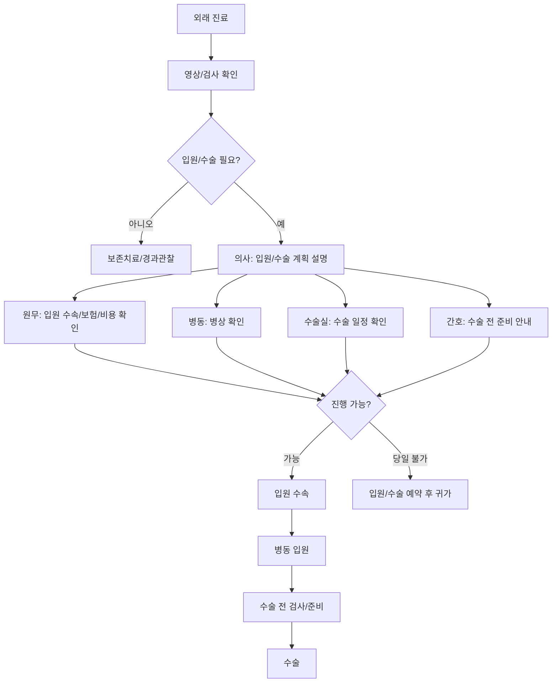
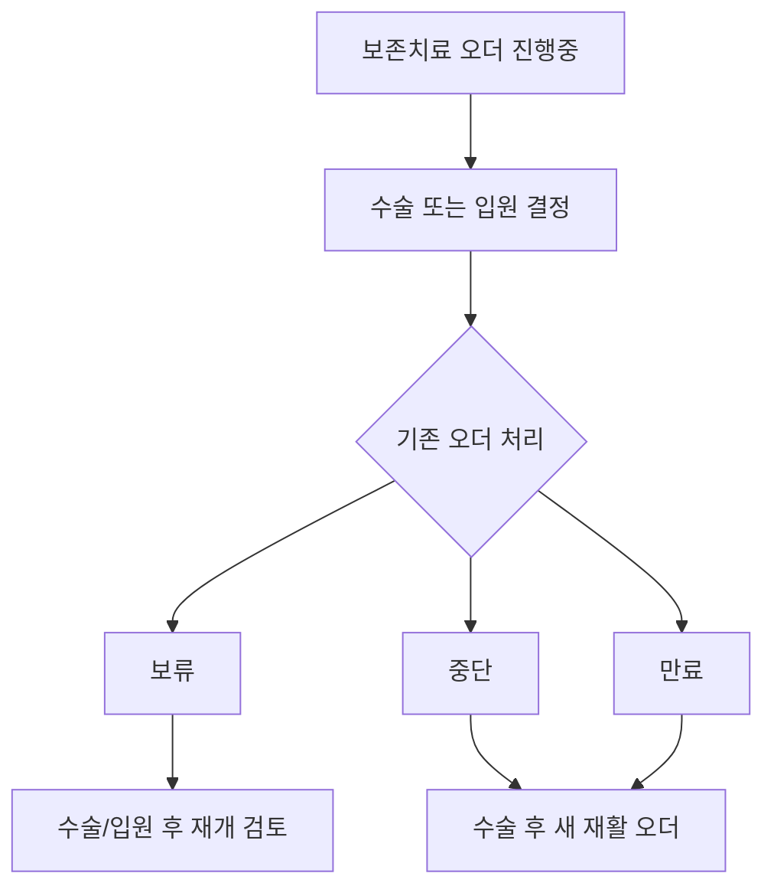

# 입원과 수술로 전환되는 흐름

## 문서 목적

이 문서는 외래 진료 중 입원 또는 수술 필요성이 확인되었을 때 병원 업무가 어떻게 병동, 수술실, 원무, 간호로 확장되는지 정리한다.

입원/수술 전환은 의사가 "수술 필요"라고 판단하는 순간 끝나는 일이 아니다. 병상, 수술실 일정, 수술 전 검사, 법정 설명/서면동의, 보호자 안내, 기존 치료 오더 처리까지 동시에 움직인다.

## 전환이 발생하는 상황

| 상황 | 특징 |
|---|---|
| 급성 골절 | 당일 영상검사 후 입원/수술로 바로 전환될 수 있다. |
| 보존치료 실패 | 약, 주사, 물리치료에도 호전이 없어 수술을 검토한다. |
| 만성 관절질환 | 수술 날짜를 예약하고 사전검사를 계획하는 경우가 많다. |
| 타 병원 의뢰 | 이미 수술 필요성이 제시된 상태로 내원할 수 있다. |
| 수술 후 재활 목적 | 수술 자체보다 입원 재활과 회복 관리가 목적일 수 있다. |

## 전체 흐름

## 당일 입원과 예약 입원

| 구분 | 당일 입원/수술 전환 | 예약 입원/수술 |
|---|---|---|
| 주된 상황 | 급성 골절, 응급성, 통증 심함 | 만성 질환, 계획 수술 |
| 원무 업무 | 즉시 입원 가능 여부, 병상, 비용 안내 | 수술일/입원일 예약, 사전 안내 |
| 병동 업무 | 당일 병상 배정과 인계 | 입원 예정 목록 관리 |
| 수술실 업무 | 가능한 수술 일정 즉시 확인 | 수술 스케줄 사전 배정 |
| 환자 안내 | 보호자 호출, 금식/준비, 입원 안내 | 입원 전 준비물, 검사, 일정 안내 |
| 시스템 상태 | 외래 접수에서 입원전환중으로 이동 | 외래 완료 후 입원예약 상태 생성 |

## 외래에서 병동으로 넘겨야 하는 정보

| 정보 | 이유 |
|---|---|
| 환자 기본정보 | 병동 입원 등록과 환자 확인 |
| 진단명/의심진단 | 입원 사유 |
| 수술 예정 여부 | 병동 준비와 수술실 연결 |
| 수술명/수술 부위/좌우 | 수술 전 준비와 환자안전 확인 |
| 통증 수준/NRS | 입원 초기 통증 관리 |
| 이동 상태 | 휠체어, 보행 불가, 낙상 위험 확인 |
| 영상/검사 결과 | 수술 판단 근거 |
| 투약/알레르기/주의사항 | 병동 간호와 수술 전 확인 |
| 보호자 연락 | 설명, 동의, 입원 안내 |

## 기존 치료 오더 처리

입원이나 수술이 결정되면 외래 보존치료 오더를 그대로 두면 안 된다.

기본값은 `기존 오더 보류 또는 중단 검토 + 수술 후 새 재활 오더 발행`이다. 수술 전 통증 완화 목적과 수술 후 기능 회복 목적이 다르기 때문이다.

## 입원/수술 상태

| 상태 | 의미 |
|---|---|
| 수술검토 | 외래에서 수술 가능성을 검토 중 |
| 입원전환검토 | 입원이 필요할 수 있어 원무/병동 확인이 필요한 상태 |
| 입원예약 | 입원일이 예정됨 |
| 수술예약 | 수술일과 수술실 일정이 예정됨 |
| 입원수속중 | 실제 입원 등록 절차 진행 중 |
| 병상배정완료 | 병실/병상이 배정됨 |
| 수술전검사중 | 수술 전 필요한 검사 진행 중 |
| 수술준비완료 | 행정/간호/동의/검사 준비가 완료됨 |

## 기존 문서와의 관계

이 문서는 기존 `07-admission-surgery-transition-flow.md`를 중심으로, `03-treatment-order-and-postoperative-rehab-flow.md`의 기존 치료 오더 처리 내용을 함께 반영했다.

이전 문서: [04-반복-치료와-재활-관리.md](04-반복-치료와-재활-관리.md)  
다음 문서: [06-수술과-병동-회복-흐름.md](06-수술과-병동-회복-흐름.md)
