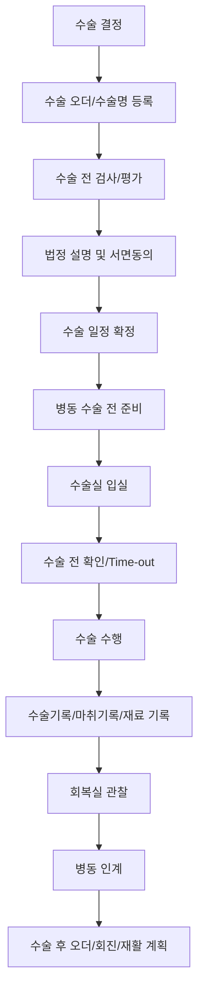
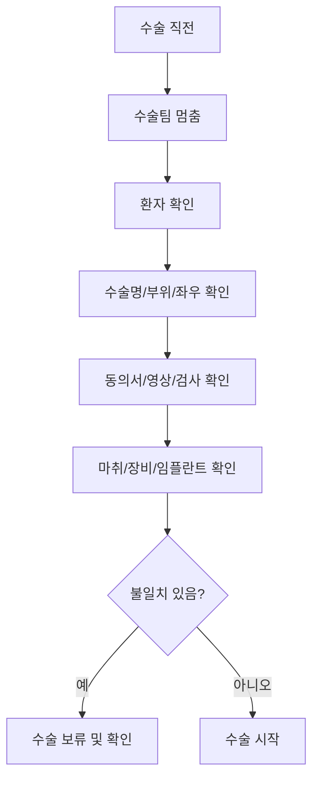
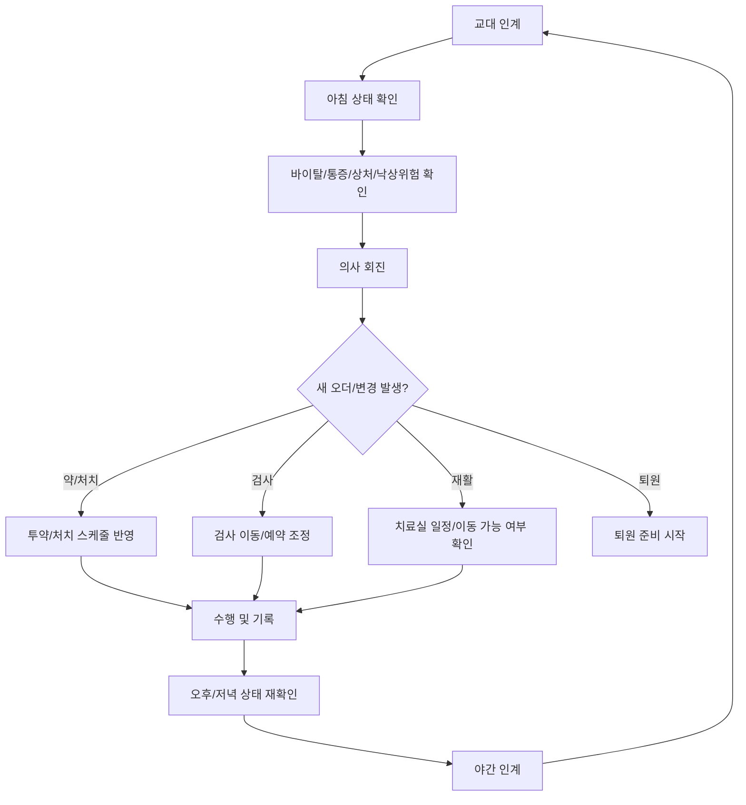

# 수술과 병동 회복 흐름

## 문서 목적

이 문서는 수술 결정 이후 수술실 준비, 수술 수행, 회복실, 병동 인계, 병동 하루 운영과 회진이 어떻게 이어지는지 정리한다.

수술과 병동은 분리된 세계가 아니다. 수술 전 준비는 병동에서 시작되고, 수술 후 기록과 오더는 병동 회복과 재활의 출발점이 된다.

## 수술 전체 흐름

## 수술 전 확인

| 확인 | 내용 |
|---|---|
| 환자 확인 | 이름, 생년월일/등록번호 등 2개 이상 식별자 |
| 수술명 | 예약된 수술명과 동의서/수술 오더 일치 |
| 부위/좌우 | 오른쪽 무릎, 왼쪽 어깨처럼 구조화된 값 |
| 동의서 | 수술, 수혈, 전신마취 등 필요한 동의 상태 |
| 금식/검사 | 금식 상태, 검사 결과, 수술 가능 여부 |
| 장비/재료 | 임플란트, 기구, 영상 장비, 보조기 |
| 감염/알레르기 | 항생제, 약물 알레르기, 감염 주의 |
| CCTV | 병원/수술 유형에 따른 안내와 요청 상태 |

## Time-out

## 수술 중/후 기록

| 기록 | 내용 |
|---|---|
| 수술기록 | 수술 전후 진단명, 수술명, 수술 일시, 방법, 내용, 경과 |
| 참여 의료인 | 집도의, 보조의, 마취 담당, 간호 등 역할 |
| 마취기록 | 마취 종류, 시간, 약물, 회복 상태 |
| 재료/임플란트 | 사용 재료, 임플란트, 로트/식별 정보 |
| 수술 후 오더 | 통증관리, 항생제, 드레싱, 영상, 재활 시작 조건 |
| 회복실 기록 | 바이탈, 의식 회복, 통증, 이상반응 |
| 병동 인계 | 수술 결과, 주의사항, 배액관/라인, 금기 동작 |

## 병동 하루 운영

병동은 입원 환자 목록이 아니라, 하루 단위로 오더가 실행되고 환자 상태가 바뀌는 운영 중심이다.

## 병동 상태

| 상태 | 의미 |
|---|---|
| 입원중 | 병동에 배정되어 관찰/치료 중 |
| 수술전준비중 | 금식, 검사, 동의, 수술실 일정 확인 중 |
| 수술실이동대기 | 수술실 호출 전 병동에서 대기 |
| 수술후회복중 | 수술 후 통증/상처/보행 상태 관찰 |
| 재활진행중 | 입원 재활 오더 실행 중 |
| 퇴원준비중 | 정산, 교육, 예약, 퇴원약 준비 중 |
| 전원/전과검토 | 현 병원 치료 범위를 넘어 추가 조치 필요 |

## 병동과 치료실 연결

수술 후 재활은 병동과 치료실이 함께 움직인다.

| 역할 | 확인할 것 |
|---|---|
| 의사 | 오늘부터 치료 가능한지, 금기 동작과 하중 제한은 무엇인지 |
| 병동 간호 | 이동 가능 여부, 배액관/통증/낙상 위험 |
| 치료실 | 치료사, 장비, 시간, 병실 방문 필요 여부 |
| 치료사 | 수술명, 수술일, 관절 가동 범위, 보행 가능 여부 |

환자가 치료실로 이동할 수 없으면 치료사가 병실로 방문해야 한다. 그래서 입원 재활 예약에는 장소가 필수다.

## 기존 문서와의 관계

이 문서는 기존 `14-surgery-room-detailed-flow.md`와 `12-inpatient-daily-ward-round-flow.md`를 하나의 수술-병동 회복 장면으로 묶었다.

이전 문서: [05-입원과-수술로-전환되는-흐름.md](05-입원과-수술로-전환되는-흐름.md)  
다음 문서: [07-퇴원과-외래-추적-재활.md](07-퇴원과-외래-추적-재활.md)
