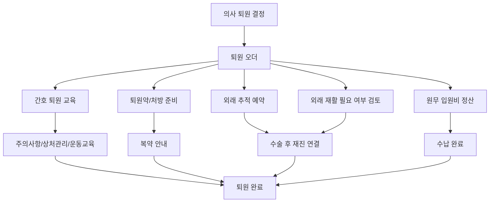
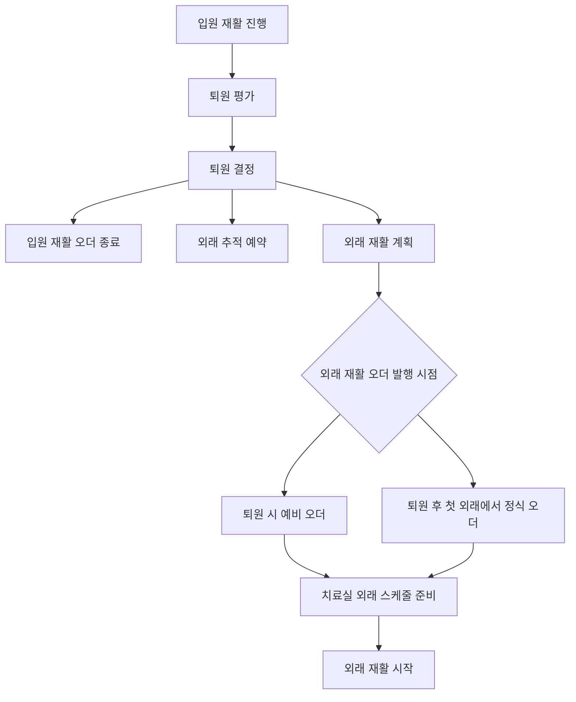

# 퇴원과 외래 추적 재활

## 문서 목적

이 문서는 입원 또는 수술 후 환자가 퇴원하고, 외래 추적 진료와 외래 재활로 다시 연결되는 흐름을 정리한다.

퇴원은 병원 업무의 끝이 아니다. 퇴원약, 상처관리 교육, 다음 외래 예약, 외래 재활 계획, 입원비 정산, 기록 인계가 모두 맞아야 환자의 회복 흐름이 끊기지 않는다.

## 퇴원 준비 흐름

## 퇴원 시 확인해야 하는 것

| 항목 | 이유 |
|---|---|
| 퇴원 가능 판단 | 통증, 상처, 보행, 감염 의심, 전신 상태 확인 |
| 퇴원약 | 복약 안내와 처방 기록 연결 |
| 상처/보조기 교육 | 재입원/감염/낙상 위험 감소 |
| 다음 외래 예약 | 수술 후 경과 확인과 기록 연속성 |
| 외래 재활 계획 | 입원 재활에서 외래 재활로 끊기지 않게 연결 |
| 입원비 정산 | 입원 에피소드의 비용 마감 |
| 제증명 요청 | 입퇴원확인서, 수술확인서, 진단서 등 |

## 입원 재활에서 외래 재활로 전환

입원 재활과 외래 재활은 같은 회복 여정에 속하지만, 같은 오더로 처리하면 안 된다.

| 구분 | 입원 재활 | 외래 재활 |
|---|---|---|
| 장소 | 병동, 치료실, 병실 방문 | 외래 치료실 |
| 기준 | 수술기록, 회진, 병동 상태 | 외래 추적 진료 판단 |
| 기록 | 입원 치료기록, 간호기록과 함께 봄 | 외래 치료 회차 기록 중심 |
| 종료 기준 | 퇴원, 입원 단계 완료 | 회차 소진, 기능 회복, 의사 종료 |
| 예약 | 병동 이동 가능성과 치료실 자원 | 환자 외래 일정과 치료실 자원 |

## 외래 재활 오더 발행 시점

퇴원 시 예비 오더를 둘지, 첫 외래에서 정식 오더를 낼지는 병원 정책과 의사 진료 방식에 따라 달라질 수 있다. 다만 입원 중 치료기록, 수술기록, 간호기록은 외래 재활에서 이어볼 수 있어야 한다.

## 퇴원 후 첫 외래에서 봐야 하는 정보

| 역할 | 필요한 정보 |
|---|---|
| 의사 | 수술기록, 병동 경과, 퇴원 당시 상태, 입원 재활 기록 |
| 치료사 | 수술명, 수술일, 금기 동작, 하중 제한, 통증 변화 |
| 원무 | 외래 예약, 치료 예약, 수납/서류 요청 |
| 간호 | 상처 상태, 통증, 이동 상태, 낙상 위험 |

## 끊기면 위험한 지점

| 위험 | 설명 |
|---|---|
| 퇴원 결정과 퇴원 완료를 동일시 | 퇴원약, 교육, 정산, 예약이 빠질 수 있다. |
| 입원 재활 기록이 외래에서 보이지 않음 | 치료사가 회복 흐름을 처음부터 다시 파악해야 한다. |
| 수술 전 보존치료 오더 자동 재개 | 수술 후 목적과 제한사항이 반영되지 않는다. |
| 외래 재활 예약 누락 | 퇴원 후 회복이 끊긴다. |
| 제증명/기록 사본 요청 누락 | 환자 민원과 법정 발급 이슈가 생긴다. |

## 기존 문서와의 관계

이 문서는 기존 `03-treatment-order-and-postoperative-rehab-flow.md`의 퇴원 후 외래 재활 전환, `12-inpatient-daily-ward-round-flow.md`의 퇴원 준비 흐름을 합쳐서 정리한 것이다.

이전 문서: [06-수술과-병동-회복-흐름.md](06-수술과-병동-회복-흐름.md)  
다음 문서: [08-비용-서류-안전-권한-기준.md](08-비용-서류-안전-권한-기준.md)
