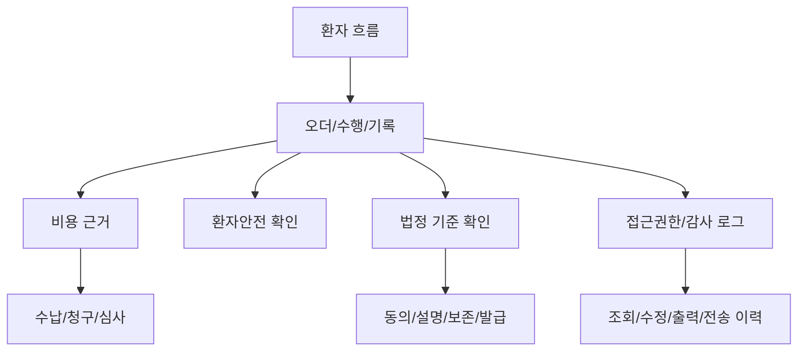
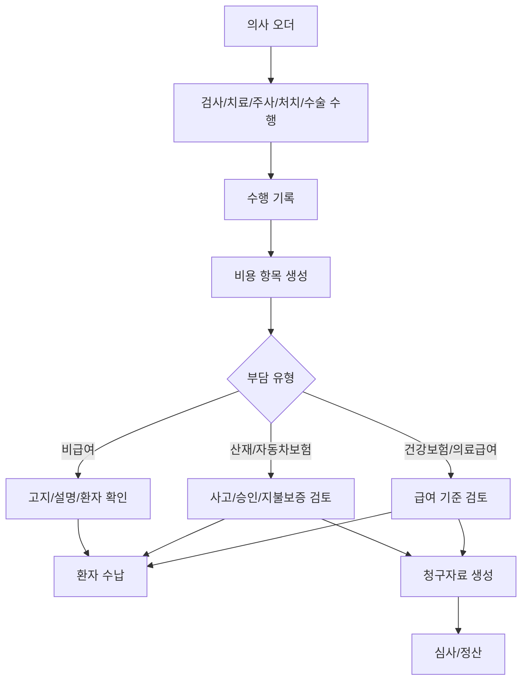

# 비용, 서류, 안전, 권한 기준

## 문서 목적

이 문서는 앞선 환자 흐름 문서 전체에 반복 적용되는 운영 기준을 정리한다.

수납, 청구, 서류 발급, 환자안전, 법정 기준, 접근권한, 감사 로그는 특정 한 단계에만 붙는 부록이 아니다. 외래, 검사, 치료, 입원, 수술, 병동, 퇴원 전부에 깔리는 기준이다.

## 적용 방식

## 수납과 청구는 다르다

| 구분 | 의미 | 주된 관심 |
|---|---|---|
| 수납 | 환자에게 받을 금액을 계산하고 결제하는 업무 | 본인부담금, 비급여, 미수금, 영수증 |
| 청구 | 보험자 또는 관련 기관에 비용을 청구하는 업무 | 급여 기준, 명세서, 상병, 수행 근거 |
| 심사 | 청구가 기준에 맞는지 확인되는 업무 | 삭감, 반송, 보완자료, 이의신청 |
| 정산 | 지급/삭감/환불/추가수납을 반영하는 업무 | 재청구, 환자 환불, 미수/과수납 |

비용은 오더 발행이 아니라 실제 수행 기록을 기준으로 확정한다.

## 서류 발급 기준

서류 발급은 하나로 묶으면 안 된다.

| 구분 | 성격 |
|---|---|
| 진료기록 사본 | 이미 존재하는 기록의 열람/사본 발급 |
| 진단서/소견서 | 의사의 의학적 판단 또는 작성이 필요한 문서 |
| 입퇴원확인서/통원확인서 | 방문, 입원, 퇴원 이력에 근거한 확인서 |
| 진료비 세부내역서 | 수납/청구 기록에 근거한 문서 |
| 수술확인서 | 수술 기록과 수술일에 근거한 문서 |

대리인, 보호자, 친족, 미성년자 발급은 구비서류와 권한 확인이 필요하다.

## 환자안전 기준

환자안전은 별도 메뉴가 아니라 수행 전후의 확인점이다.

| 위험 | 발생 구간 | 필요한 확인 |
|---|---|---|
| 환자 오인 | 접수, 영상, 주사, 치료, 수술 | 2개 이상 식별자 확인 |
| 좌우/부위 오류 | 영상, 주사, 수술, 재활 | 부위와 좌우를 구조화 |
| 알레르기 누락 | 약 처방, 주사, 입원 투약 | 오더 입력과 수행 전 경고 |
| 낙상 | 외래 이동, 병동, 치료실 이동 | 낙상 위험평가와 이동 보조 |
| 통증 악화 | 치료, 주사, 재활 | 치료 전후 NRS, 중단/보고 기준 |
| 수술 불일치 | 수술 전 준비, 수술실 | 동의서, 예약, 수술명, 부위, time-out 일치 |
| 기록 누락 | 모든 구간 | 수행 완료와 기록 완료 분리 |

## 법정 기준과 병원 정책의 경계

이 문서는 법률 자문이 아니다. 법정 항목은 2026-05-15 기준 기존 문서와 국가법령정보센터 공개 조문을 바탕으로 정리했으며, 실제 적용 전 병원 원무, 심사, 개인정보보호, 법무 담당자의 최종 확인이 필요하다. 다만 기획 단계에서는 법정 기준이 있는 부분을 병원 정책으로 덮지 않아야 한다.

| 영역 | 기준 방향 |
|---|---|
| 비급여 | 동의서 필수로 일반화하지 않고 항목/가격 고지와 사전 설명 상태를 관리 |
| 수술/수혈/전신마취 | 일반 안내가 아니라 법정 설명 및 서면동의 흐름으로 관리 |
| 수술실 CCTV | 안내, 요청, 촬영, 보관, 열람/제공 상태를 별도 관리 |
| 진료기록 | 진료기록, 간호기록, 수술기록, 검사기록의 기재/보존 기준 고려 |
| 물리치료/영상검사 | 치료사와 영상실은 독립 처방 주체가 아니라 의사 오더/지도 구조 |
| 노쇼/취소 | 자동 비용 부과보다 상태 기록과 원무 확인 흐름으로 처리 |

## 접근권한과 감사 로그

접근권한은 직원 여부가 아니라 현재 업무상 필요를 기준으로 잡아야 한다.

| 역할 | 기본 접근 방향 |
|---|---|
| 원무 | 환자 인적사항, 예약, 접수, 보험, 수납, 제증명 요청 중심 |
| 간호 | 외래/병동 환자 상태, 오더 진행, 간호/투약/처치 기록 |
| 의사 | 담당 환자의 진료기록, 검사, 영상, 치료, 병동, 수술 정보 |
| 치료사 | 치료 오더, 재활 제한사항, 관련 요약, 치료기록 |
| 영상실 | 영상 오더, 촬영 대상 정보, 부위/좌우, 수행 기록 |
| 병동 | 입원 환자 정보, 투약, 수술/재활 계획, 인계 |
| 수술실 | 수술 일정, 동의 상태, 수술 부위, 수술 관련 기록 |
| 심사/청구 | 청구에 필요한 오더, 수행, 비용 근거 |
| 시스템 관리자 | 계정/권한/설정 중심. 진료내용 열람은 별도 통제 |

감사 로그에는 사용자, 역할, 환자, 객체, 행위, 시간, 장치/위치, 변경 전후, 사유가 남아야 한다.

## 위험한 설계 패턴

| 위험 패턴 | 이유 |
|---|---|
| 접수, 진료, 오더, 치료, 수납을 하나의 상태로 합침 | 업무 객체의 생명주기가 다르다. |
| 치료 예약을 외래 예약 안에 포함 | 치료는 치료사/장비/공간 일정으로 움직인다. |
| 오더 발행과 수행 완료를 동일시 | 실제 수행 여부, 이상반응, 비용 근거가 사라진다. |
| 노쇼를 자동 청구 | 실제 수행 여부, 사전 고지, 청구 기준 문제가 생긴다. |
| 수술 동의를 일반 체크박스로 처리 | 법정 설명/서면동의와 변경 고지 이력이 부족하다. |
| 진료기록 사본을 의사 승인 대기로 묶음 | 기록 사본 발급과 진단서/소견서 작성은 다르다. |
| 관리자에게 진료내용 전체 접근 허용 | 운영 권한과 의료정보 접근 권한이 혼재된다. |
| 수정 시 이전 값이 사라짐 | 기록 정정, 분쟁, 감사 대응이 어렵다. |

## 실제 병원 확인이 필요한 질문

| 질문 | 왜 필요한가 |
|---|---|
| 입원실과 수술실을 실제로 운영하는가 | 병동, 수술실, CCTV, 회복실 흐름의 적용 범위가 결정된다. |
| 약은 원내 조제인가, 원외 처방 중심인가 | 약제, 재고, 투약, 처방전 흐름이 달라진다. |
| 치료실 예약은 원무가 잡는가, 치료실이 잡는가 | 스케줄 화면과 권한이 달라진다. |
| PACS/RIS와 EMR이 이미 있는가 | 영상 상태와 진료 화면 연동 방식이 달라진다. |
| 청구는 자체 처리인가, 외부 프로그램/대행인가 | 청구/심사 기능 범위가 달라진다. |
| 수술별 재활 프로토콜이 있는가 | 재활 오더 템플릿과 치료사 기록 구조가 달라진다. |
| 보호자/대리인 업무가 얼마나 많은가 | 동의, 사본 발급, 설명, 수납 흐름이 달라진다. |

## 주요 공식 기준 출처

- [의료법 제24조의2 의료행위에 관한 설명](https://www.law.go.kr/lsLinkCommonInfo.do?chrClsCd=010202&lsJoLnkSeq=1026149929)
- [의료법 제38조의2 수술실 CCTV](https://www.law.go.kr/lsLinkCommonInfo.do?chrClsCd=010202&lsJoLnkSeq=1026150283)
- [의료법 시행규칙 제14조 진료기록부 등의 기재 사항](https://www.law.go.kr/lsLinkProc.do?chrClsCd=010202&datClsCd=010102&gubun=admRul&joNo=001400000&lsId=56387&lsNm=%EC%9D%98%EB%A3%8C%EB%B2%95%EC%8B%9C%ED%96%89%EA%B7%9C%EC%B9%99&mode=10)
- [의료법 시행규칙 제15조 진료기록부 등의 보존](https://www.law.go.kr/LSW/lsSideInfoP.do?docCls=jo&joBrNo=00&joNo=0015&lsiSeq=283869&urlMode=lsScJoRltInfoR)
- [의료법 시행규칙 제42조의2 비급여 진료비용 등의 고지](https://www.law.go.kr/lsLinkProc.do?chrClsCd=010202&datClsCd=010102&gubun=admRul&joNo=004202002&lsId=60112&lsNm=%EC%9D%98%EB%A3%8C%EB%B2%95%EC%8B%9C%ED%96%89%EA%B7%9C%EC%B9%99&mode=10)
- [의료법 시행규칙 제16조 전자의무기록 관리ㆍ보존](https://www.law.go.kr/lsLinkProc.do?chrClsCd=010202&datClsCd=010102&gubun=admRul&joNo=001600000&lsId=54667&lsNm=%EC%9D%98%EB%A3%8C%EB%B2%95%EC%8B%9C%ED%96%89%EA%B7%9C%EC%B9%99&mode=10)
- [환자안전법 제14조 환자안전사고의 보고 등](https://www.law.go.kr/lsLinkProc.do?ancYd=20160729&chrClsCd=010202&joLnkStr=%EB%B2%95+%EC%A0%9C14%EC%A1%B0%EC%A0%9C1%ED%95%AD&joNo=001400000&lsClsCd=RL&lsId=012635&lsNm=%ED%99%98%EC%9E%90%EC%95%88%EC%A0%84%EB%B2%95&mode=10&ordinNm=%ED%99%98%EC%9E%90%EC%95%88%EC%A0%84%EB%B2%95)

## 기존 문서와의 관계

이 문서는 기존 `05-reception-payment-insurance-document-flow.md`, `08-legal-and-policy-baseline-check.md`, `09-realistic-planning-baseline.md`, `10-patient-safety-and-risk-control.md`, `13-claim-and-billing-review-flow.md`, `15-access-control-audit-log-policy.md`, `16-post-supplement-realistic-risk-review.md`의 기준 내용을 통합한 것이다.

이전 문서: [07-퇴원과-외래-추적-재활.md](07-퇴원과-외래-추적-재활.md)
